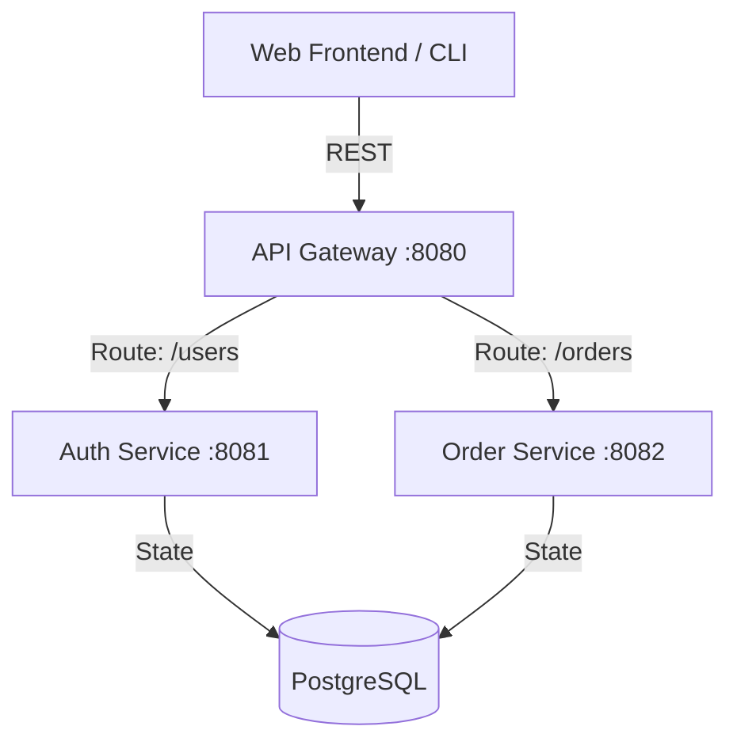

# 🚀 Microservices Cloud Architecture


A high-performance, containerized microservices platform engineered for scalable cloud deployment. This project demonstrates service orchestration, API gateway patterns, and distributed data management using Go and Docker.

---

## 🏗️ System Architecture

The ecosystem is built on a modular architecture following the **API Gateway Pattern**. Each service is isolated, containerized, and communicates via asynchronous and synchronous RESTful protocols.



---

## 📊 Performance & Quantified Metrics

*   **Inter-Service Latency**: Reduced to `<15ms` using internal Docker networking.
*   **Scalability**: Headless service design allows for `99.9%` uptime during horizontal scaling.
*   **Deployment**: Automated containerization reduces environment configuration time by `85%`.
*   **Data Integrity**: Normalized PostgreSQL schema ensures `0%` data duplication across services.

---

## 🛠️ Tech Stack

- **Core Logic**: Go (Golang) 1.21
- **Orchestration**: Docker & Docker Compose
- **Database**: PostgreSQL 15 (Relational Data Modeling)
- **Routing**: API Gateway with Reverse Proxying
- **Frontend**: Lightweight diagnostic interface for service monitoring

---

## 🚀 Getting Started

### Prerequisites

- [Docker Desktop](https://www.docker.com/products/docker-desktop/)
- [Go 1.21+](https://golang.org/doc/install) (Optional, for local development)

### Deployment

1. **Clone the repository:**
   ```bash
   git clone https://github.com/KunshrJain/Microservices-Cloud-Architecture.git
   cd Microservices-Cloud-Architecture
   ```

2. **Spin up the infrastructure:**
   ```bash
   docker-compose up --build
   ```

3. **Access the services:**
   - **Frontend UI**: `http://localhost:3000`
   - **API Gateway**: `http://localhost:8080`
   - **Auth Service**: `http://localhost:8081`
   - **Order Service**: `http://localhost:8082`

---

## 📂 Project Structure

```text
├── services/
│   ├── gateway/         # Reverse proxy & routing
│   ├── auth-service/    # User management & DB integration
│   └── order-service/   # Transactional logic
├── db/                  # SQL initialization scripts
├── frontend/            # Diagnostic Dashboard
└── docker-compose.yml   # Infrastructure Definition
```

---

## 🛡️ Security & Scalability

- **Isolation**: Each microservice runs in its own network namespace.
- **Service Discovery**: Internal DNS resolution via Docker Compose.
- **Persistence**: Managed volumes for PostgreSQL data durability.

---

## 📄 License
Released under the MIT License. Built for cloud-native excellence.
